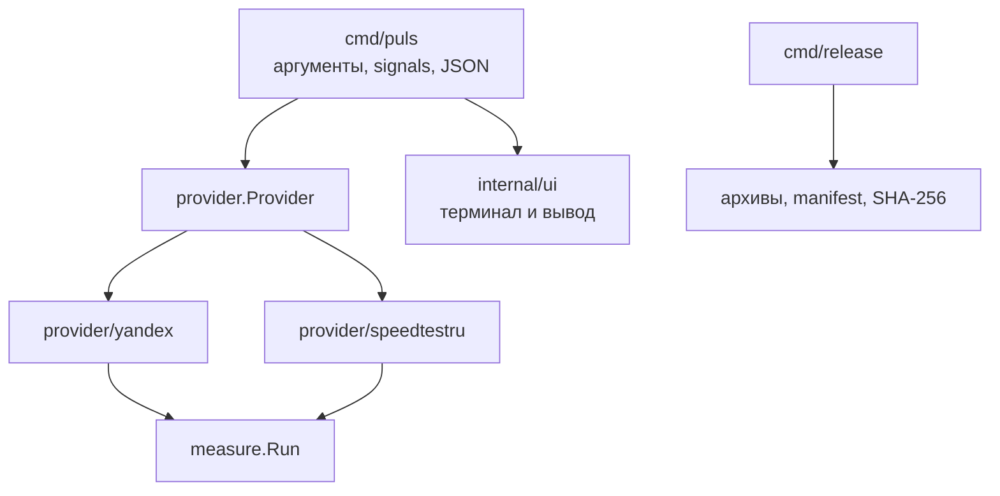

# Архитектура Puls

Puls разделяет командный интерфейс, сетевые протоколы, общий движок измерений и
релизную упаковку. Такое разделение не позволяет деталям конкретного сервиса
просачиваться в CLI или влиять на подсчёт байтов другого источника.

## Поток выполнения

Один источник проходит фазы `select → ping → download → upload`. В `all`
источники запускаются последовательно, чтобы они не делили пропускную
способность. Внутри throughput-фазы несколько потоков работают параллельно
через общий движок.

## Ответственность каталогов

| Каталог | Ответственность |
| --- | --- |
| `cmd/puls` | Разбор CLI, orchestration, сигналы, коды завершения и JSON-модель |
| `cmd/release` | Воспроизводимая сборка архивов и release metadata |
| `internal/provider` | Общий контракт источников, результаты и типизированные ошибки |
| `internal/provider/yandex` | Discovery и протокол Яндекс.Интернетометра |
| `internal/provider/speedtestru` | Discovery, авторизация и протокол speedtest.ru |
| `internal/measure` | Независимый от источника concurrency engine для throughput |
| `internal/ui` | Определение терминала, интерактивный выбор, прогресс и human output |

`internal` намеренно закрывает реализацию от внешнего импорта. Публичным
интерфейсом проекта остаются исполняемый файл, CLI и JSON.

## Неизменяемые правила измерения

- Таймер начинается после готовности первого worker; warm-up не учитывается.
- В скорость входят только подтверждённые протоколом или успешным HTTP-ответом
  байты.
- Неожиданный status, schema, тип WebSocket frame или размер payload является
  ошибкой, а не успешным нулевым результатом.
- Ошибки потоков агрегируются; при отказе всех потоков фаза завершается раньше
  deadline.
- Один worker может переподключиться один раз. Вся throughput-фаза повторно не
  запускается.
- Отмена context прекращает сетевой ввод-вывод и ожидает завершения worker.
- Сбой одного источника не останавливает остальные источники в режиме `all`.

Полный нормативный список и правила отдельных протоколов закреплены в
[AGENTS.md](../AGENTS.md).

## Границы доверия и приватность

Puls обращается только к публичным first-party endpoints веб-клиентов. Ответы
сети считаются недоверенными: они ограничиваются по размеру и проверяются до
использования. Временные JWT и IP-related ответы хранятся только в памяти и не
попадают в verbose-логи. Телеметрия и отправка результатов обратно сервисам
отсутствуют.

## Проверка изменений

Основная пирамида тестов:

1. unit-тесты общего engine, статистики, CLI и release builder;
2. локальные HTTP/WebSocket mock-тесты протоколов, включая ошибочные ответы;
3. race detector, vet, staticcheck и govulncheck;
4. live discovery/ping за build tag `live`;
5. throughput live только при явном `PULS_LIVE_THROUGHPUT=1`.

Релизный сборщик создаёт шесть базовых архивов, два прямых установщика, машинный
`RELEASE_MANIFEST.json` и `SHA256SUMS.txt`. Подробный контракт описан в
[документе о дистрибуции](distribution.md).
