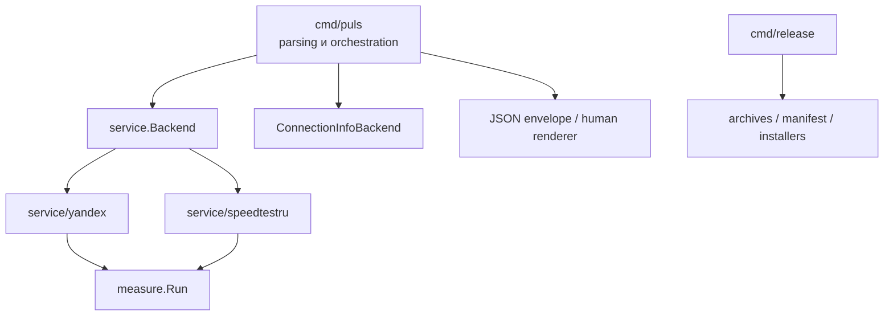

# Архитектура Puls

Puls разделяет CLI, протоколы сервисов измерения, общий throughput engine и
релизную упаковку. Публичные границы проекта — команды, JSON schema и release
assets; Go-пакеты находятся в `internal`.

## Термины

- **Сервис измерения** — Яндекс.Интернетометр или speedtest.ru.
- **Сервер измерения** — выбранный CDN/QMS host.
- **Интернет-провайдер** — оператор подключения пользователя.
- **Endpoint** и **probe** используются только внутри протокола и verbose-лога.

## Поток выполнения

Измерение проходит `select → ping → download → upload`. В `all` сервисы
выполняются последовательно и не делят канал. Определение подключения для
`all --show-ip` выполняется один раз: speedtest.ru, затем Яндекс при ошибке.

## Ответственность

| Каталог | Содержимое |
| --- | --- |
| `cmd/puls` | parsing, configuration, orchestration, result models, JSON и rendering |
| `cmd/release` | targets, build, archives, manifest, checksums и installers |
| `internal/service` | `Backend`, `ConnectionInfoBackend`, типы, HTTP/runtime helpers |
| `internal/service/yandex` | discovery, connection info, ping, throughput и upload protocol |
| `internal/service/speedtestru` | discovery, connection info, ping, authorization и throughput |
| `internal/measure` | независимый concurrency engine и точный byte accounting |
| `internal/ui` | TTY detection, выбор, стили и адаптивный progress |

Зависимости и logger передаются через constructors/options. Сетевые реализации
не пишут в terminal напрямую, а measurement configuration не содержит UI.

## Инварианты измерения

- Таймер начинается после готовности первого stream; warm-up не учитывается.
- В результат входят только подтверждённые протоколом или успешным HTTP-ответом
  байты.
- Status, Content-Type, Content-Encoding, JSON schema, WebSocket message type и
  payload size проверяются до учёта данных.
- Ошибки workers агрегируются; отказ всех streams завершает фазу раньше.
- Stream может переподключиться один раз, throughput целиком не повторяется.
- Context cancellation закрывает I/O и ожидает cooperative workers.
- Ошибка отдельного сервиса не останавливает `all`.

Ошибки имеют `service`, `phase`, стабильный `code`, `retryable` и исходный
`cause`. Классификация основана на typed/sentinel errors, `errors.Is/As`,
`context` и `net.Error`, а не на тексте сообщения.

## Подключение и приватность

`ConnectionInfo.ExternalIP` обязателен для успеха; `ISP` необязателен. Яндекс
возвращает IP из ограниченного bootstrap-состояния страницы, speedtest.ru — IP
и ISP из `/api/asn_provider/ip` и `/api/asn_provider/asn`. Ответы ограничиваются
по размеру и проверяются как единственное JSON-значение.

JWT, browser keys, IP-ответы и результаты не записываются на диск и не попадают
в verbose-лог. Puls не отправляет telemetry.

## Проверка

1. Unit и local HTTP/WebSocket mock tests.
2. `go test -count=10`, race, vet, staticcheck и govulncheck.
3. actionlint, shellcheck и integration tests установщиков.
4. Live discovery/IP/ping за tag `live`.
5. Live throughput только с `PULS_LIVE_THROUGHPUT=1`.

Релизный контракт описан в [distribution.md](distribution.md), нормативные
правила для AI-разработчиков — в [AGENTS.md](../AGENTS.md).
